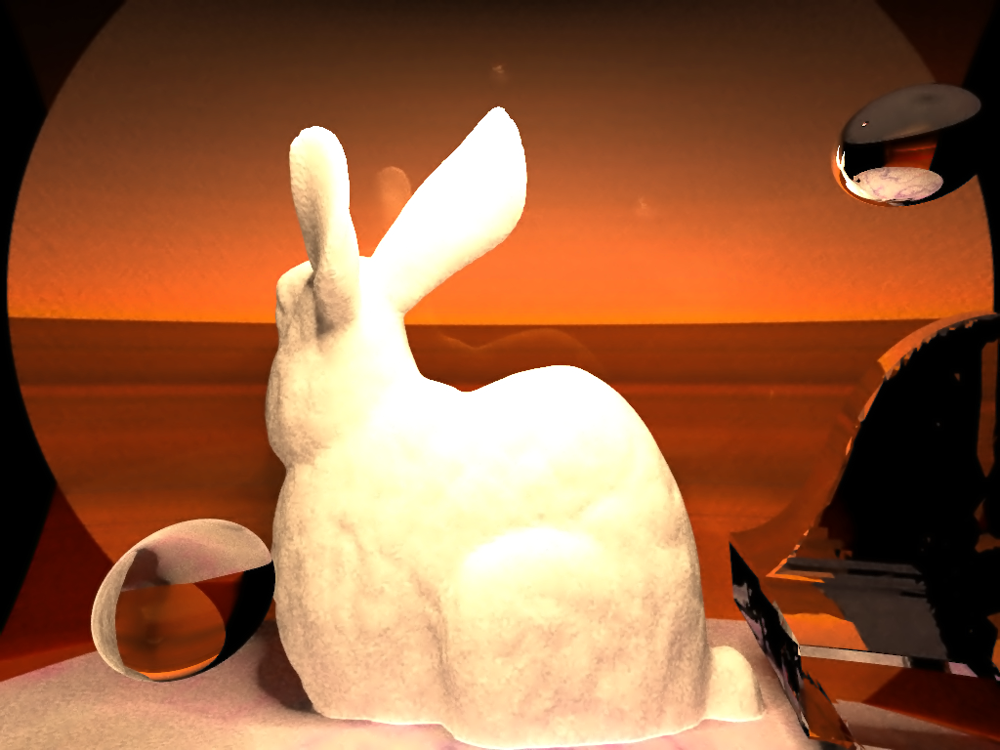
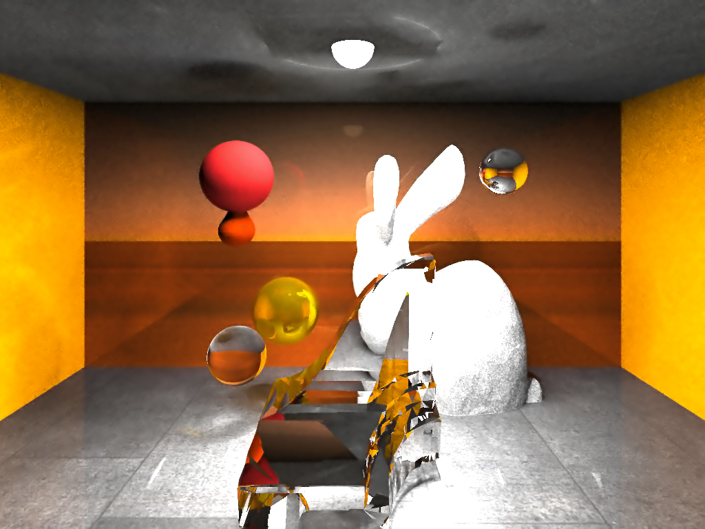

# ComputerGraphics
Stochastic Progressive Photon Mapping

## Reference

Physically Based Rendering: http://www.codinglabs.net/article_physically_based_rendering_cook_torrance.aspx

Physically Based Rendering - Cook–Torrance: http://www.codinglabs.net/article_physically_based_rendering_cook_torrance.aspx

SPPM Framework: https://github.com/shizhouxing/SPPM

Bezier + Texture: https://github.com/Trinkle23897/Computational-Graphics-THU-2018

PPM: https://github.com/zhengpingzhou/PPM

Denoising: http://rcm.cps.utexas.edu/
